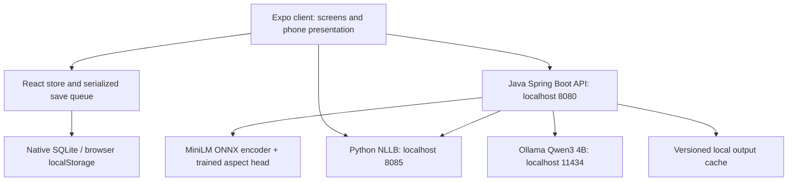

# Lauda — Design document

Current implementation: 4 October 2026. This is the single design reference for the runnable repository, replacing the historical plans in `docs/`. Filenames are relative to the repository root. The 60-second technical demo script is in section 10.

## 1. Product and execution boundary

Lauda helps a small business owner understand multilingual reviews and prepare replies. Noor’s Coffee Farm is a synthetic demonstration workspace, not the app’s identity. The active tabs are **Home → Reviews → Bookings → Insights → Help**. Business Profile, onboarding and Offline & AI are secondary screens.

The client is React Native, Expo SDK 57, TypeScript and Expo Router. The desktop web build presents the same interactive screens inside a phone frame. This is a real running interface, not a Figma prototype or proof that inference runs on a phone.

**Current inference runs on the laptop:** a Java API performs review classification and aggregation, Python serves NLLB translation, and Ollama serves local Qwen generation. After dependencies and model weights are prepared, laptop inference does not require internet. A completely disconnected phone can read saved content and edit local records; fresh laptop inference needs a connection to the laptop.

Included: review reading/translation, review-specific sentiment and aspect gauges, editable generated response ideas, local draft/approval, aggregate Insights and customizable narration, manual bookings, business profile, authored Help and cached results. Not included: customer inbox, tourist review submission, live Yelp ingestion, automatic review posting, cloud synchronization, server authentication or phone-only model inference.

## 2. Architecture and responsibility map



### Client

| File | Responsibility |
|---|---|
| `src/app/_layout.tsx` | Global provider, navigation stack and demo frame. |
| `src/app/(tabs)/_layout.tsx` | Five Expo Router tabs; onboarding redirect when no profile exists. |
| `src/components/bottom-navigation.tsx` | Shared visible navigation, selection and unanswered count. |
| `src/components/demo-frame.web.tsx` | Centered desktop phone frame; narrow web screens fill the viewport. |
| `src/components/demo-frame.tsx` | Native pass-through; no artificial frame on an actual phone. |
| `src/app/(tabs)/index.tsx` | Home: review queue, pending bookings and workspace shortcuts. |
| `src/app/(tabs)/reviews.tsx` | Search, response status, language filtering and review list. |
| `src/app/reviews/[id].tsx` | Original review, reading language, editable reply, translation and approval. |
| `src/components/review-analysis.tsx` | Sentiment, up to three aspect gauges, supporting evidence and Qwen ideas. |
| `src/app/(tabs)/insights.tsx` | Saved-first brief, summary customization, charts and evidence. |
| `src/components/feedback-graphics.tsx` | Rating ring/distribution, sentiment strip, aspect bars and monthly ratings. |
| `src/app/(tabs)/bookings.tsx`, `src/app/bookings/new.tsx`, `src/app/bookings/[id].tsx` | Local booking list, creation and detail/editing. |
| `src/app/(tabs)/help.tsx`, `src/ai/app-help.ts` | Local authored guidance and navigation shortcuts; not a generative chatbot. |
| `src/app/onboarding.tsx`, `src/app/profile.tsx`, `src/app/offline.tsx` | Local setup, business facts and service configuration/readiness. |
| `src/components/ui.tsx`, `theme.ts`, `studio.tsx` | Shared layout, colors, controls and searchable/scrollable language picker. |
| `src/ai/review-api.ts`, `src/ai/insights-api.ts` | HTTP calls, strict result validation, ID mapping and cache identity. |
| `src/ai/laptop-translation.ts`, `src/ai/translation-cache.ts` | Translation service access, provenance and exact-input cache matching. |
| `src/state/store.tsx`, `src/data/types.ts` | State contracts and serialized persistence before publishing updates to screens. |
| `src/data/storage.ts`, `src/data/storage.web.ts` | Native SQLite and web localStorage adapters. |
| `src/data/review-demo.ts`, `src/data/demo-upgrade.ts`, `src/data/profile.ts` | Synthetic fixtures, compatible upgrades and sample/business separation. |
| `src/data/booking-actions.ts`, `src/data/rules.ts` | Booking validation/capacity rules; retained legacy compatibility helpers. |
| `src/data/nllb-languages.json` | Shared 202 language/script options, approximately 200 languages. |

### Backend and models

Java service files below live in `backend/src/main/java/com/lauda/api/service/`.

| File | Responsibility |
|---|---|
| `backend/src/main/java/com/lauda/api/controller/ReviewController.java` | Versioned routes, request bounds, settings validation and readiness. |
| `backend/src/main/java/com/lauda/api/dto/Dto.java` | API request/response records; explicit generation versus classifier metadata. |
| `ReviewAnalysisService.java` | Preserve original reviews; translate non-English text to English before classification. |
| `ClassifierService.java` | Tokenization, ONNX embeddings, learned head, thresholds, sentence evidence and sentiment. |
| `InsightService.java` | All-review processing, exact statistics, deterministic findings and persistent base snapshots. |
| `InsightsJobService.java` | Single background batch with processed/total progress and polling. |
| `InsightsLlmService.java` | Customized Qwen paragraph from ranked themes and bounded representative evidence. |
| `ReplyService.java`, `ReplyLlmService.java` | Review-specific generated ideas, checks, localization and labeled template fallback. |
| `ReviewTranslationService.java` | Target-aware NLLB calls and persistent translation reuse. |
| `LocalLlmClient.java` | Shared pinned loopback Ollama client; JSON output, bounded concurrency and sampling. |
| `LocalOutputCache.java` | Bounded versioned disk cache, atomic writes, corrupted-entry recovery. |
| `backend/src/main/resources/prompts/insights-system.txt`, `reply-system.txt` | Separate task prompts; customer text is evidence, never instructions. |
| `backend/src/main/resources/application.properties` | Service/model/cache configuration. |
| `ml/artifacts/head_v1.json`, `encoder/tokenizer.json`, `encoder/model.onnx` | Learned weights/thresholds and local encoder; large ONNX weights are downloaded, not committed. |
| `ml/artifacts/golden.json`, `backend/src/test/java/com/lauda/api/service/ParityTest.java` | Python/Java numerical parity reference and test. |
| `ai/translation/run.py`, `server.py`, `requirements.txt` | Local NLLB loading, inference, HTTP bridge and Python dependencies. |
| `ai/insights/model-manifest.json` | Qwen model, quantization, digest, prompt versions and execution boundary. |
| `ai/replies/cases.jsonl`, `scripts/evaluate-local-replies.py` | Separate authored reply smoke cases and local evaluation runner. |

## 3. What each model actually does

### Aspect classification

The encoder is `sentence-transformers/paraphrase-multilingual-MiniLM-L12-v2`. Java mean-pools token embeddings, L2-normalizes the 384-dimensional vector, applies a learned linear head and sigmoid scores, then checks per-label thresholds. Evidence is selected from sentence/clause scores. This is a trained classifier, not Qwen making up ratings.

The artifact has positive/negative labels for guide, price/value, communication, facilities, access/transport, food and other. **Communication and other are currently disabled** in the head, leaving five active aspects. Native tested-language metadata lists English and Swahili, but the current API deliberately translates every non-English review to English first; the dropdown’s language coverage is not classifier accuracy coverage. Inputs are truncated to 128 tokens and very short/no-hit reviews are flagged.

Overall sentiment uses aspect polarity when available; otherwise it falls back to the original review stars (4–5 positive, 1–2 negative, 3 neutral). That fallback is labeled. An aspect activation score is not a business-quality score or statistical confidence guarantee.

### Translation

`facebook/nllb-200-distilled-600M` runs locally through Python. The catalog contains 202 language/script tokens. Reading translation, owner-language drafts and final customer-language replies use this service. Some demo records also contain authored/sample language variants; those must remain distinguishable from newly computed translations.

Models and dependencies download once. Cached-only runtime is supported. CPU translation can be slow for new text, especially on the first pass; successful exact text/language pairs are cached. Selection in the dropdown does not imply evaluated quality in every language. The checkpoint uses CC-BY-NC-4.0 and its model card identifies production deployment as outside its intended research scope; review these constraints before a commercial release; bundling a setup script does not bundle its weights into an iPhone.

### Local generation

Qwen is **`qwen3:4b`, Q4_K_M**, served by Ollama. Manifest digest: `359d7dd4bcdab3d86b87d73ac27966f4dbb9f5efdfcc75d34a8764a09474fae7`; download approximately 2.5 GB. The smaller 0.6B version was rejected after observed complaint reversals and wrong-speaker responses. Current prompt versions are `reply-v4-grounded` and `insights-v4-customized`.

Both tasks use schema-constrained JSON with application validation. Thinking is disabled and context is bounded. One inference is active at a time with at most four active/queued calls. The classifier, translator and Qwen are independent capabilities: unavailable Qwen does not erase counted findings.

## 4. Request sequencing

### A. App opening and saving

1. `StoreProvider` loads saved state through the platform storage adapter.
2. Demo upgrades run compatibly; the profile and current workspace render.
3. Compatible saved analysis, translations and drafts appear immediately.
4. Updates enter a serialized queue. Storage is written before the new state is published; save failure is not reported as success.

Native storage is one JSON snapshot in `app_state` inside SQLite `noor.db`; the old filename preserves existing installs. Web uses `lauda-state-v1` in localStorage and can copy the old `noor-state-v1` value. These are not normalized SQL review tables or cloud-backed accounts. Legacy message fields remain for existing-data compatibility even though no inbox is exposed.

### B. Opening Insights

1. `src/ai/insights-api.ts` sorts reviews by stable app ID, assigns numeric API IDs and retains the mapping for evidence links.
2. If a matching saved result exists, render it without a new backend request. Otherwise post a job containing reviews, owner language, narrative flag and summary settings.
3. Java processes **every review**: English directly; other languages through local NLLB. Translation failure retains original text and marks that record for checking.
4. Java counts original ratings and sentiment; eligible aspect hits form strengths/problems with source quotes. Processed total and usable-aspect total remain separate.
5. Qwen receives ranked positive/negative themes and at most six bounded evidence excerpts. It writes two qualitative sentences for Brief or four for Standard, with tone/focus instructions. Java prepends exact coverage and average-star context.
6. Optional NLLB localization changes the paragraph’s reading language. Quantitative and qualitative payloads remain unchanged.
7. The client polls progress, validates payload/IDs and persists the completed result. Failures preserve the last valid overview.

**Refresh** calls the backend again, but identical review inputs/settings can reuse the backend’s saved analysis and paragraph. It is not a force-regeneration button. **Customize summary** uses `snapshot_id` to change narration without translating/classifying the whole corpus again. An expired snapshot needs Refresh. Jobs themselves are in memory (up to eight retained jobs), not crash-resumable database jobs; completed snapshots persist separately.

### C. Generating and approving a reply

1. Open a review. Load compatible analysis; show sentiment, up to three aspect gauges and evidence.
2. Generate/Reload posts actual review text, owner language, business name and allowed facts (`experience`, `hours`) with `regenerate: true`.
3. Qwen uses English review text or a real NLLB English translation. Obvious instruction sentences are removed from generation input; the original review remains intact.
4. Reload bypasses generation cache, supplies a fresh variant and prior wording, and samples at temperature 0.65 with a new seed. Normal non-regeneration API requests can reuse results. Insights generation remains deterministic.
5. Validate structure, length, owner voice, distinct drafts, selected unsupported topics and commitments. Repeated prior English wording triggers a bounded retry. A failed reload keeps the previous ideas visible rather than replacing them; validation cannot prove factual accuracy or guarantee every request succeeds.
6. The owner explicitly selects an idea or writes their own reply. Generating ideas never overwrites the editor.
7. NLLB translates the **edited** response into the customer’s chosen language. Editing text/languages invalidates the earlier translation and stale requests.
8. The owner checks and approves. Lauda saves the exact response and provenance locally; it does not publish to Yelp or another platform.

## 5. Payload to UI mapping

| Endpoint / field | Display or behavior |
|---|---|
| `GET /v1/health` | Classifier readiness and Qwen capabilities/prompt versions. |
| `POST /v1/reviews/analyze`, `analysis.overall_sentiment / sentiment_source` | Per-review sentiment banner, including star fallback. |
| `analysis.aspects[].score / evidence` | Semicircle detection gauges and supporting text. |
| `POST /v1/reviews/reply-draft`, `drafts / generation / requires_approval` | Short/detailed ideas, generated/template labels and explicit owner approval. |
| `POST /v1/insights/jobs`, `GET /v1/insights/jobs/{id}` | Batch progress and completed aggregate. |
| `meta.total / analysed / unread / translated / translation_failed` | Coverage line: processed, included, translated and needs checking. |
| `quantitative.average_rating / rating_distribution` | Rating ring and star bars, based on original stars. |
| `quantitative.sentiment / aspects` | Sentiment strip and positive/negative mention bars. |
| `quantitative.trend` | Monthly line only when there are at least two rated months. |
| `qualitative.strengths / problems` | Evidence-backed positive/negative cards. Count/share denominators use eligible reviews. |
| `quotes / review_ids` | Original/English evidence and links mapped to the correct app review. |
| `attention.unread_review_ids` | “A closer look” human-checking section. |
| `narrative.summary / model / prompt_version` | Centralized Qwen paragraph and provenance. |
| `POST /v1/insights/summary` | Matching saved snapshot plus new length/tone/focus/language settings. |
| NLLB `POST /translate` (`text`, `from`, `to`) | Actual reading/reply translation with model version and latency. |

One review can mention multiple aspects and both polarities. Mention totals therefore need not equal review totals. `model_version` on review analysis describes the classifier; `generation` describes Qwen; translation metadata describes NLLB. These are not interchangeable.

## 6. Offline storage, caches and safety decisions

- **Local-first owner data:** native SQLite / browser localStorage contains profile, reviews, bookings, preferences, analysis, translations, owner drafts and approvals. Browser persistence is tied to origin; switching ports is a different workspace.
- **Backend persistence:** `.ai-cache/generated-results.json` stores bounded successful generation and analysis snapshots with atomic writes. Translation outputs persist separately. Failed translations are not frozen in a permanent successful snapshot.
- **Cache validity:** content, review ordering/ID mapping, settings, business context and relevant model/prompt/pipeline versions determine reuse. Runtime assets are not committed to Git.
- **No silent cloud fallback:** local-service failure leaves saved results/manual work available and exposes a clear unavailable/busy/timeout state. Authored templates are labeled.
- **Untrusted review text:** bounded inputs, schema/ID checks, source validation, filtered reply instructions, commitment checks and mandatory human approval. These controls reduce risk, but model and translation errors remain possible.
- **Service boundary:** defaults use loopback and deliberate development-origin allowlists. Translation LAN mode requires explicit private-interface setup/pairing. Do not expose raw Ollama or use wildcard CORS to make a hosted demo work.
- **Presentation:** SVG graphics and bundled assets avoid remote chart/font dependencies. Charts retain text labels for accessibility. The phone frame changes presentation, not model location.
- **No overbuilt authentication:** local profile/onboarding fits the single-owner demo. Public multi-user hosting requires a separate authenticated data/API design.

## 7. Setup, run and verification

From the repository root, prepare while online. Node must meet Expo SDK 57 requirements (22.13.x or newer), Java 17+ and Maven are needed for the backend. Install official Ollama if absent. Translation setup reports a supported Python environment and installs its pinned dependencies.

```sh
npm ci
python3 scripts/setup-review-model.py
npm run translate:setup
python3 scripts/start-small-llm.py --setup
npm run ai:build
npx expo export --platform web
```

If Qwen setup starts its own service and stays running, finish readiness, then use another terminal for remaining commands. After preparation:

```sh
npm run demo:offline
```

Open `http://localhost:8087`. Keep the launcher running. It starts/reuses compatible prepared local services without model downloads; Ctrl+C stops only children it started. Rebuild Java after backend edits and re-export the web client after frontend edits. Separate service commands are `npm run ai:llm`, `npm run translate:offline`, `npm run ai:backend`, and `python3 scripts/serve-demo.py`. Development UI: `npm run web` on 8082.

```sh
npm run typecheck
npm run lint
npm test
# Backend tests, using normal Maven dependencies or an already prepared local cache:
mvn -f backend/pom.xml test
npm run ai:evaluate
```

### Evidence recorded, not marketing claims

- Current frontend: 46 tests; backend: 20 tests; typecheck, lint and production web export passed before this documentation consolidation. After consolidation, all 46 frontend tests, typecheck, lint and web export passed again; no backend runtime code changed.
- All 150 demo reviews processed: 135 translated, 102 with usable aspect findings, 48 needing checking, zero translation failures in the recorded full batch. The corpus is 15 authored scenarios across ten languages, not 150 independent customers; 40 contain example replies. No raw Yelp data is presented as Noor’s customer feedback.
- Thirty separate authored reply smoke cases produced distinct drafts and expected topic terms. Median 2.02 seconds, p95 4.45 seconds on the tested laptop before the fresh-reload update. This is heuristic testing, not measured semantic accuracy.
- Three consecutive actual regenerated requests changed both English drafts: approximately 3.97, 2.57 and 5.55 seconds. UI Reload also changed both drafts and left the owner editor unchanged.
- French summary localization: 32.23 seconds; French owner-language drafts: 28.14 seconds. After Java restart, saved results loaded in 0.10 seconds or less. Timings are laptop-specific; provenance retains original generation latency rather than cache HTTP timing.
- Artifact-recorded classifier validation macro-F1 is approximately 0.363 versus a 0.228 baseline. This is a historical artifact metric, not a newly reproduced real-world benchmark or an accuracy percentage for all languages. Numerical Python/Java parity is separately tested.
- Physical Wi-Fi-off and native iPhone airplane-mode tests have not been established by these checks. Test them before claiming those outcomes.

### Demo acceptance sequence

Prepare/build models before recording. Show a saved overview, change a summary preference, expand evidence, generate a fresh reply, translate edited text and approve locally. For an actual offline proof, disable internet while keeping localhost services alive and produce a new uncached result. Stop services separately to show saved data still opens. A phone needs a remaining local link for new laptop inference. Do not toggle network off for the first time during the recorded demo.

## 8. Decisions and remaining implementation work

| Decision | Why / next step |
|---|---|
| Keep an Expo mobile client and a local laptop inference stack | Runnable prototype now; genuine native model packaging remains separate work. |
| Translate to English before the classifier | Broader input coverage without claiming the trained head supports every language; translation errors can affect findings. |
| Count in Java; narrate with Qwen | Keeps ratings, coverage and chart numbers authoritative and independent of generated wording. |
| Upgrade from Qwen 0.6B to 4B | Better observed reply behavior at higher disk/RAM cost; continue human evaluation. |
| Saved analysis snapshots separate from summaries | Preference changes are cheaper than reprocessing 150 reviews. |
| Serialized JSON storage for the MVP | Simple, compatible persistence; normalize SQLite or use IndexedDB when imports/history grow. |
| Preserve legacy storage fields and small compatibility helpers | Avoid losing old owner data; remove only after an explicit schema migration. |
| Keep Help authored and bookings manual | Reliable offline utilities; no claim of customer messaging or booking-platform integration. |

Three-person split: **AI/model owner** labels a held-out real corpus, measures per-aspect precision/recall and multilingual reply correctness, improves disabled/weak categories and monitors invented claims. **UI/demo owner** rehearses the 60-second recording, checks real iPhone keyboard/accessibility and clear generated/cached/error states. **Offline/data owner** implements operator imports, deduplication/source attribution, export/backup, versioned migrations and durable job recovery. Preserve originals and separate evaluation data from business records.

External ingestion, normalized persistence, durable jobs, a standalone installed build and phone-local inference are roadmap items, not implemented features. Yelp preparation uses `scripts/prepare-yelp-evaluation.py`; its output is ignored locally. Review dataset/model licenses before distributing source reviews or weights. Public hosting needs authenticated HTTPS APIs or labeled saved fixtures; the current local server is not a service-worker-backed offline PWA.

## 9. Reference and document policy

This file supersedes the previous 20 Markdown documents under `docs/`, including historical branch assessments and obsolete model plans. Git history retains those sources. `README.md` is the concise entry point; model/training/license documents adjacent to their code remain available. No runtime caches or owner state were removed by consolidation.

Primary references: [Expo SDK 57](https://docs.expo.dev/versions/v57.0.0/), [Expo SQLite](https://docs.expo.dev/versions/v57.0.0/sdk/sqlite/), [Ollama chat API](https://docs.ollama.com/api/chat), [Qwen3 4B model](https://ollama.com/library/qwen3:4b), [NLLB checkpoint/model card](https://huggingface.co/facebook/nllb-200-distilled-600M), [FLORES language resources](https://github.com/facebookresearch/flores/tree/main/flores200), [Lovable GitHub integration](https://docs.lovable.dev/integrations/github), [Lovable hosting](https://docs.lovable.dev/tips-tricks/deployment-hosting-ownership). Recheck external product features and licensing before publishing.
