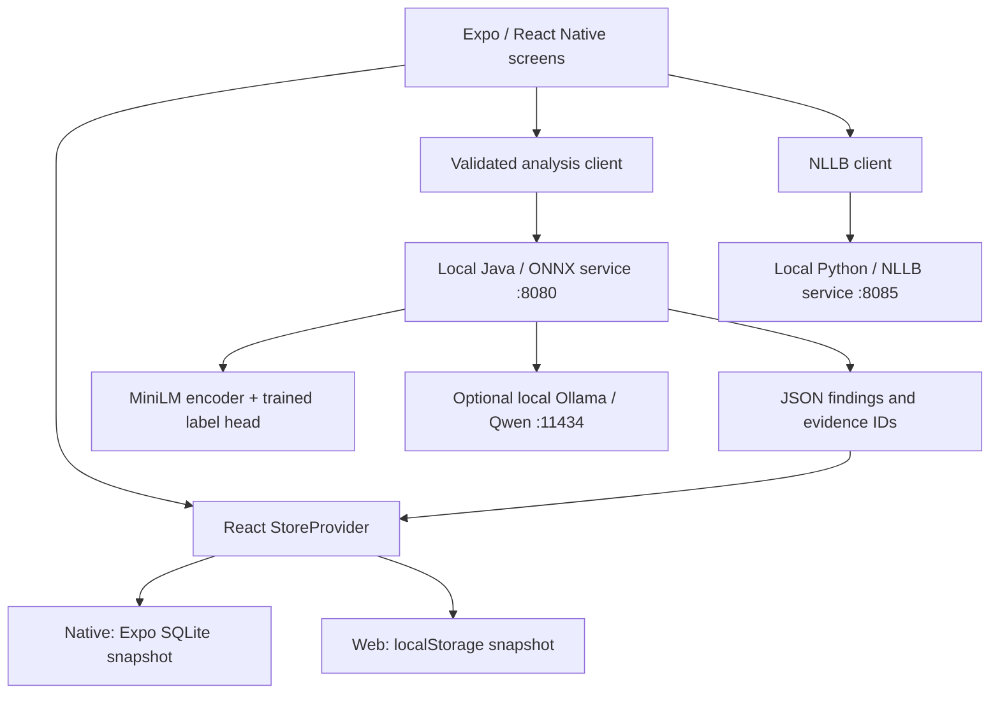

# Current architecture

## 1. Scope and source of truth

This review compares main at `acc1958` with the mobile integration at `f21bdee`. See the [design index](README.md). The integration is the running application; main contains a newer, unfinished analysis design. A successful integration run does not establish that main builds.



All arrows to inference services describe the **integration** branch. Main does not yet provide this complete path. There is no backend database in either inspected snapshot.

## 2. Frontend inventory — integration branch

The frontend uses TypeScript 6, Expo SDK 57, React 19 and React Native 0.86. `package.json` specifies the exact installed version ranges and scripts. `app.json` configures the Lauda identity; the folder name `noor-ai` and native SQLite filename are legacy identifiers.

| Existing filename | Responsibility |
| --- | --- |
| `src/app/_layout.tsx` | Root navigation, StoreProvider and status bar. |
| `src/app/(tabs)/_layout.tsx` | Business-profile gate and five tab routes. |
| `src/components/bottom-navigation.tsx` | Visible custom bottom navigation. |
| `src/app/onboarding.tsx` | Local business setup; explicit sample-business option. |
| `src/app/(tabs)/index.tsx` | Home summary and next actions. |
| `src/app/(tabs)/reviews.tsx` | Review list and filters. |
| `src/app/reviews/[id].tsx` | Review reading, language selection, translation, drafts, suggestions and approval. |
| `src/app/(tabs)/insights.tsx` | Analysis request, saved results, category counts, suggestions and fallback presentation. |
| `src/app/insights/[id].tsx` | Existing rule-based insight evidence detail. |
| `src/app/ideas/[id].tsx` | Curated idea detail. |
| `src/app/(tabs)/bookings.tsx` | Local booking list. |
| `src/app/bookings/new.tsx`, `src/app/bookings/[id].tsx` | Manual booking creation and detail. |
| `src/app/(tabs)/help.tsx` | Navigation help using authored local answers. |
| `src/app/profile.tsx`, `src/components/profile-form.tsx` | Business profile and preferences. |
| `src/app/offline.tsx` | Storage, saved analysis, translation endpoint and pairing controls. |
| `src/components/ui.tsx`, `src/components/theme.ts`, `src/components/studio.tsx` | Reusable visual components, theme and brand presentation. |
| `assets/lauda-mark.svg` | Brand mark. |
| `src/app/messages/index.tsx`, `src/app/messages/[id].tsx`, `src/legacy/` | Compatibility/legacy messaging code, not an active customer inbox tab. |

### Startup and state ownership

`src/state/store.tsx` loads the persisted `Data`, applies demo upgrades, then exposes state to screens. Its update queue saves a new snapshot before publishing the new React state. `src/data/types.ts` defines profile, reviews, drafts, approved replies, translations, bookings and analysis cache.

`src/data/profile.ts` creates empty state and handles business setup. There is one workspace, without a stable business UUID. Switching/creating a profile clears or filters demo-related state; it is not multi-business tenancy.

## 3. Persistence and review inputs — integration

| Existing filename | Current behavior |
| --- | --- |
| `src/data/storage.ts` | Native SQLite `noor.db`, WAL, one JSON snapshot in `app_state`. |
| `src/data/storage.web.ts` | Web `localStorage`, key `lauda-state-v1`, migration fallback from `noor-state-v1`. |
| `src/data/demo.ts`, `src/data/review-demo.ts` | Sample business and 150 synthetic reviews across ten languages. |
| `src/data/demo-upgrade.ts` | Versioned sample-review upgrades. |
| `scripts/build-review-demo.py` | Builds synthetic demo fixtures. |
| `scripts/prepare-yelp-evaluation.py` | Prepares a local Yelp evaluation sample; not an automatic production review importer. |
| `src/data/review-tools.ts`, `src/data/rules.ts`, `src/data/booking-actions.ts` | Review and booking validation/helper logic. |

The native table is effectively:

```sql
CREATE TABLE app_state (
  id INTEGER PRIMARY KEY CHECK (id = 1),
  version INTEGER NOT NULL,
  json TEXT NOT NULL
);
```

This persists a small demo well, but there are no normalized review tables, full migration framework, schema validation or robust corruption recovery. Web and native do not share storage automatically. Each browser origin has separate data: `localhost:8087`, `localhost:8084` and `127.0.0.1:8087` are different workspaces from the browser's perspective.

Synthetic fixtures, their authored translations and curated ideas must remain visibly distinct from measured model output. The Yelp preparation tool does not prove Noor received those reviews, and stripping IDs does not guarantee free-text anonymization. No live review-platform ingestion or external reply publishing exists today.

## 4. Existing AI client boundaries — integration

| Existing filename | Responsibility and limit |
| --- | --- |
| `src/ai/review-analysis.ts` | Calls the laptop `/workspace/analyze` endpoint; validates review IDs, complete coverage, aspect names, finite scores and evidence membership; creates the corpus fingerprint. |
| `src/ai/review-categories.ts` | Keyword fallback categories; not a learned model. |
| `src/ai/feedback.ts`, `src/ai/ideas.ts` | Rule-based findings and authored product ideas. |
| `src/ai/assistant-contract.ts` | Typed reply/recommendation provider seam and provenance requirements. |
| `src/ai/review-assistant.ts` | Provider currently unset; falls back to templates. |
| `src/ai/review-replies.ts` | Authored reply templates, with optional translation. |
| `src/ai/laptop-translation.ts` | Endpoint validation, health/pairing and NLLB requests. |
| `src/ai/translation-cache.ts` | Exact review-text/source-language/target-language cache, bounded to 300 entries. |
| `src/ai/app-help.ts` | Authored local app-navigation assistance. |
| `src/data/nllb-languages.json` | Language selection catalogue; availability is not measured translation quality. |

Fresh review analysis is permitted for the laptop web workflow and uses a loopback endpoint. Native fresh analysis is disabled in the inspected UI; saved results can still be read. The analysis timeout is 180 seconds; translation has a 90-second request timeout and a 10-second health timeout. Long timeouts are not performance guarantees.

The current analysis cache stores `{ fingerprint, savedAt, result }`. Its fingerprint serializes review IDs, text, language and rating in their current order. Reordering reviews changes it. It does not incorporate a model artifact hash. A changed corpus must not display an old result as current.

Reading translations persist separately. A manually composed response translation is not a general translation-cache entry; an approved `ReviewReply` preserves the final translated reply. Saving the source draft alone does not guarantee its translation will survive reload.

## 5. Laptop inference services — integration

### Java analysis service

| Existing filename | Responsibility |
| --- | --- |
| `backend/pom.xml` | Java 17, Spring Boot, ONNX Runtime and tokenizer dependencies. |
| `backend/src/main/java/com/lauda/api/LaudaApiApplication.java` | Spring application entry point. |
| `backend/src/main/resources/application.properties` | Port 8080, loopback binding and model-directory setting. |
| `backend/src/main/java/com/lauda/api/controller/WorkspaceController.java` | Validated string-ID workspace endpoint, ID mapping and result metadata. |
| `backend/src/main/java/com/lauda/api/controller/ReviewController.java` | Older numeric-ID analysis/insight endpoints and health. |
| `backend/src/main/java/com/lauda/api/service/ClassifierService.java` | Tokenization, MiniLM embeddings, mean pooling, normalization, label-head scoring and thresholds. |
| `backend/src/main/java/com/lauda/api/service/InsightService.java` | Aggregates recurring positive/negative aspects and supplies canned actions. |
| `backend/src/main/java/com/lauda/api/service/SmallLlmService.java` | Optional local Qwen ideas using constrained JSON output and evidence IDs assigned by the server. |

The workspace endpoint checks unique IDs, up to 300 reviews, nonempty text up to 4,000 characters, ratings 1–5 and bounded language strings. Classification and full workspace requests are serialized. This is synchronous processing, not a durable background job system.

MiniLM embeddings plus a trained multi-label head identify aspects and sentiment. This classifier is a small learned model, but not a generative LLM. Optional `qwen3:0.6b` through Ollama adds up to three action ideas. It does not write the current suggested review replies. If Ollama is absent or fails, classifier results still have a useful fallback.

### Translation service

`ai/translation/run.py` prepares local NLLB assets. `ai/translation/server.py` loads those assets with local-only model loading and exposes translation. It serializes inference, segments long input, and records model provenance and latency. Pairing protects the optional private-LAN bridge; the frontend keeps the pairing token in memory, so reopening the app may require pairing again.

The model is `facebook/nllb-200-distilled-600M`. This is a downloaded laptop model, not a cloud translation request and not an embedded iPhone model. NLLB's model card restricts intended use and uses a noncommercial license; commercial deployment needs a licensing/model choice review. Its language catalogue should not be presented as 200 equally tested language pairs. [Official model card](https://huggingface.co/facebook/nllb-200-distilled-600M).

`ai/translation/test_runner.py`, `ai/translation/test_server.py` and `ai/translation/cases.jsonl` provide evaluation/server checks. The browser CORS allowlist includes the current port 8087 in the integration snapshot.

### Launch and packaging files

`script` paths below are all integration files:

- `scripts/setup-review-model.py`: downloads and checks the encoder artifact.
- `scripts/start-review-ai.py`: builds/starts Java; its offline path relies on an already built jar, so rebuild after source changes.
- `scripts/start-small-llm.py`: starts project-local Ollama; setup downloads Qwen once.
- `scripts/serve-demo.py`: serves the exported browser app on loopback port 8087 with route fallback.
- `package.json`: web/dev, typecheck, lint and TypeScript test scripts.

The static server is not a service worker/PWA implementation. A remote hosted UI also cannot reach this laptop's loopback services from a judge's computer.

## 6. Training and artifacts — both branches, different contents

`ml/common.py`, `ml/labels_config.py`, `ml/prepare_yelp.py`, `ml/assign_splits.py`, `ml/validate_data.py`, `ml/train.py`, `ml/evaluate.py`, `ml/export.py`, `ml/infer.py` and `ml/debug_scores.py` implement preparation, training, evaluation and export. `ml/make_seed_data.py` prepares seed examples.

`ml/artifacts/head_v1.json` contains weights, thresholds, disabled labels and declared metrics. `ml/artifacts/encoder/` contains tokenizer/config assets; the large encoder weight file is downloaded separately. `ml/artifacts/golden.json` checks numerical inference parity, which is different from human-labeled accuracy.

`ml/assign_splits.py` hashes `group` into train/validation/test and sends handwritten examples to test. Preserve the group definition when retraining to avoid business-level leakage. Yelp preparation uses weak labels, deriving sign largely from stars and aspects from keywords. Mixed reviews need human aspect-level labels rather than assuming the overall rating applies to each sentence.

## 7. New main-only analysis design

Main changes the numeric API DTOs in `backend/src/main/java/com/lauda/api/dto/Dto.java`. Review hits gain evidence/issue fields; insights gain owner language, grouped problems/strengths, counts, shares, severity labels, evidence quotes and unread IDs.

Main adds:

- `backend/src/main/java/com/lauda/api/service/IssueMatcher.java`: embedding similarity against `ml/artifacts/issues.json`, with an approximately 0.55 default issue threshold.
- `backend/src/main/java/com/lauda/api/service/Phrasebook.java`: authored localized templates from `ml/artifacts/phrasebook.json`.
- `backend/src/main/java/com/lauda/api/service/AnalysisService.java`: intended coordinator, currently empty.
- `backend/src/main/java/com/lauda/api/service/Translator.java`: intended translation adapter, currently an empty class.
- `ml/eval_issues.py`: currently empty evaluation placeholder.

The newer `ClassifierService.java` selects a best-scoring sentence/clause as evidence. This is a model heuristic, not proof that the selected quote supports the finding. The newer `InsightService.java` excludes flagged reviews and groups by aspect, sentiment and issue. It depends on the unfinished coordinator, translation adapter and empty phrasebook artifact.

## 8. API divergence

Integration `/workspace/analyze` accepts string review IDs and returns `model`, `version`, `source`, `latencyMs`, `testedLanguages`, per-review results, `praised`, `criticized`, `suggestions` and optional `llm` advice. Main `/insights` accepts an owner language and numeric-ID reviews and returns `problems`, `strengths`, `aspects`, quotes and unread information.

These are not interchangeable response shapes. Keep `/workspace/analyze` as the frontend boundary and adapt the richer implementation beneath it, or introduce a new versioned endpoint and client together. Constructor and method signatures also differ: a normal Git merge alone will not make the Java code compile.

## 9. Trust and operational boundaries

No authentication server exists. Current state is local to the device/browser; approval means local saving, not posting. Review text must be treated as untrusted input to Qwen. Keep constrained output validation, allowed categories and source IDs; do not permit model text to execute actions.

The working Java service binds loopback and uses a limited CORS list. New main allows all CORS origins and lacks the same loopback setting; restore deliberate binding and allowed origins before exposing a LAN endpoint. A simple `GET /health` returning `ok` is not model readiness. Model files, tokenizer, label head and optional translator require separate capability reporting.
