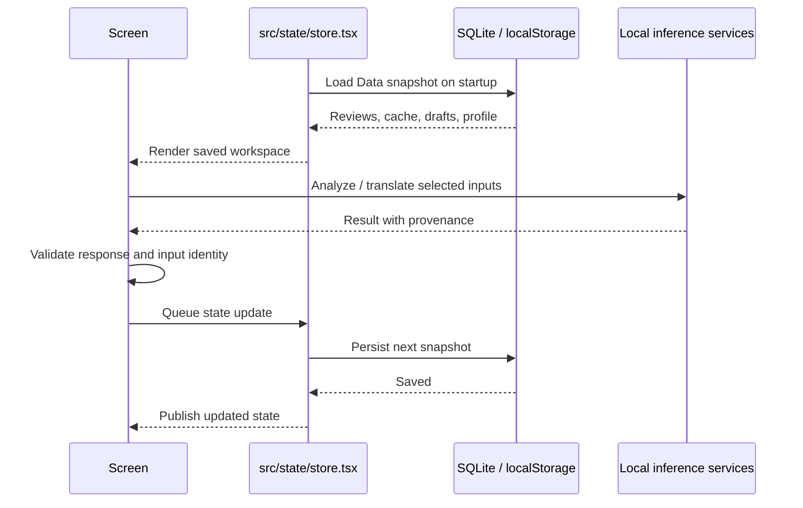

# Offline data, loading and inference design

This document separates existing behavior from proposed implementation. Reviewed main: `acc1958`; integration: `f21bdee`. Existing frontend/script filenames below belong to integration unless stated otherwise.

## 1. What “store the backend” should mean

Store **review inputs, validated analysis results, translations and drafts** in the app's local database. Load them into React state immediately when the app opens. Keep model weights and the inference runtime separately on the machine that performs inference. Saving JSON does not put a Java server, Python runtime or LLM onto an iPhone.

Three offline modes have different requirements:

| Mode | Works today? | Requirement |
| --- | --- | --- |
| Laptop browser, Wi-Fi off, existing data | Yes in integration | Keep local static server running; browser state persists at the same origin. |
| Laptop browser, Wi-Fi off, new analysis/translation | Integration supports this after setup | Java, NLLB and optional Ollama run locally; all dependencies/weights already downloaded. |
| Phone without a laptop connection | Cached/local records only | Phone-only new inference needs additional native runtime/model integration. |

A private-LAN translation bridge can support a phone while it can reach the laptop. Turning the laptop's Wi-Fi off removes that link. Laptop loopback inference continues. Native review analysis is currently disabled, so exposing Java on LAN alone is not a complete mobile implementation.

## 2. Current save/load path



`src/data/storage.ts` uses SQLite on native; `src/data/storage.web.ts` uses browser storage. `src/ai/review-analysis.ts` verifies analysis before it is saved; `src/ai/translation-cache.ts` matches translations against original text and languages. Neither Java service has a persistent review database.

[Expo SQLite](https://docs.expo.dev/versions/v57.0.0/sdk/sqlite/) persists data across app restarts. The current app uses native SQLite but browser localStorage; moving the browser to SQLite would require a separate implementation and web setup. Do not describe the current web storage as SQLite.

## 3. First implementation: harden the existing snapshot

This is the smallest useful next step; a normalized schema can follow later.

**Modify existing `src/data/types.ts`:** add `schemaVersion`, stable `businessId`, per-review content revision, and analysis metadata containing API schema version, pipeline hash, owner language and input hash. Extend saved drafts to preserve translated text, translation provenance and the precise source text/language pair that produced it.

**Modify existing `src/ai/review-analysis.ts`:** calculate a canonical input hash from sorted stable IDs and unchanged text/language/rating, business ID, owner language and pipeline identity. Preserve the exact payload used for a request; reject the response if workspace inputs changed while it was running. Adding/removing/editing a review invalidates the current aggregate.

**Modify existing `src/ai/translation-cache.ts`:** include translator artifact identity, source/target language codes and text hash. Keep original text and translated text. Reuse a translation only for the same key; do not silently reuse translations across changed models.

**Modify existing `src/state/store.tsx`:** validate loaded state, migrate schema versions and retain recoverable backups before destructive migrations. Failed writes must not publish success. Failed analysis must leave the last good cache intact and visible as stale if appropriate.

**Modify existing `src/app/offline.tsx`:** show local storage status separately from analysis/translation/LLM readiness. An internet-connected flag is not proof a localhost service is reachable, and internet disconnection does not imply localhost is unavailable.

**Proposed new files:** `src/data/migrations.ts`, `src/data/backup.ts`, `src/ai/model-manifest.ts`, `src/ai/capabilities.ts`. These are recommendations, not existing modules.

## 4. Recommended versioned result envelope

The following is a **proposed contract**, not the existing `/insights` response. Use it for a new endpoint or a deliberate adapter. It supports the richer main findings while retaining string IDs.

```json
{
  "schemaVersion": 2,
  "businessId": "business-uuid",
  "runId": "run-uuid",
  "inputHash": "sha256-of-canonical-input",
  "pipelineHash": "sha256-of-model-and-config-manifest",
  "ownerLanguage": "en",
  "createdAt": "2026-10-03T20:00:00Z",
  "source": "local-laptop-model",
  "models": {"encoder": "pinned-revision", "head": "head-sha256", "llm": null},
  "latencyMs": 0,
  "coverage": {"total": 150, "analysed": 140, "flagged": 10},
  "reviews": [],
  "findings": [],
  "suggestions": [],
  "warnings": []
}
```

Numbers above illustrate shape, not measured results. Each finding should carry stable ID, aspect, issue, polarity, count, denominator, source review IDs, original evidence quotes and provenance. Translated evidence belongs alongside original evidence with its own model hash and languages. A generated suggestion carries a separate source/model from classifier output. Do not call a classifier score a statistical confidence interval.

Validate schema version; IDs and exact workspace coverage; finite scores; allowed category/polarity enums; unique evidence IDs; evidence membership; bounded text/arrays; matching input and pipeline identity. Display model-language support separately from the owner's selectable translation language.

## 5. Longer-term SQLite schema — proposed

For hundreds of reviews the JSON snapshot is acceptable. Normalize when import, incremental analysis, multi-business state or large histories make it necessary. The following table names are **not implemented**:

| Proposed table | Key and contents |
| --- | --- |
| `businesses` | `id`, name, owner language, profile JSON, revision. |
| `reviews` | `(business_id,id)`, source/source ID, original text, language, rating, date, content hash, demo flag. |
| `analysis_runs` | run ID, business ID, input hash, pipeline hash, owner language, status, result JSON, timestamp, error. |
| `review_analysis` | business/review/content/model keys; aspect hits, flags, evidence data. |
| `findings` | run/finding ID, aspect/issue, polarity, count, denominator, text and action. |
| `finding_evidence` | run/finding/review keys, original quote and optional translated-quote reference. |
| `translations` | text hash, source/target codes, translator hash, original and translated text, provenance. |
| `reply_drafts` | business/review ID, owner text, languages, translated text, model provenance and save time. |
| `approved_replies` | immutable approval record, exact final text, source version and approval time. |
| `jobs` | job ID, input key, status, attempt count, last error and next eligible retry. |

Use composite foreign keys where needed to prevent evidence crossing businesses. Save a complete result/run/evidence set inside one transaction; do not show a half-written analysis. Store model files outside SQLite and reference their manifest. Never mix evaluation reviews into a business workspace by default.

**Proposed file map:** `src/data/database.ts` for opening/schema; `src/data/repositories/reviews.ts`, `analysis.ts`, `translations.ts` for SQL; `src/data/jobs.ts` for durable jobs. Preserve `src/state/store.tsx` as the UI boundary. Choose a browser persistence adapter intentionally, preferably IndexedDB for larger offline data; do not pretend it will synchronize with native SQLite automatically.

## 6. Loading, processing and recovery

1. Load the local profile and reviews immediately, then select the newest compatible completed analysis.
2. If its input/model/language key differs, show it as saved but stale, with an explicit recompute action.
3. Probe local capabilities: classifier, translator and optional LLM separately. Probe service/model readiness rather than checking internet availability alone.
4. Create a persisted job with immutable input IDs/hashes. Transition `pending -> running -> completed` or `failed`; recover a job left running after a crash as interrupted/pending.
5. Call the relevant local runtime. A timeout may leave server work running; use request/job IDs to prevent duplicate committed results. Current synchronous endpoints do not implement this server-side protocol.
6. Validate the result and compare request inputs to current state. Persist transactionally, then update the UI.
7. Retry transient unavailability with bounded backoff; require user correction for invalid data/pairing. Keep manual text and previous results throughout.

Incremental processing can reuse per-review results when content and classifier hash are unchanged. Recompute aggregate findings when the corpus changes. Invalidate all affected review hits when the model/head/thresholds change; changing only owner-language presentation may reuse classification but needs new localized findings/translations. Qwen suggestions can be cached separately from the underlying deterministic counts.

No cloud synchronization is required for the hackathon. Later, an outbox for external reply publishing must remain separate from local approval and retry with idempotency keys. Do not label a locally approved reply “published.”

## 7. Models and local launch requirements

Existing integration files provide the starting point:

| File | Local setup responsibility |
| --- | --- |
| `scripts/setup-review-model.py` | Download/check MiniLM ONNX encoder. |
| `scripts/start-review-ai.py` | Build/run Java backend. Rebuild after source changes before offline use. |
| `scripts/start-small-llm.py` | Prepare/start local Ollama and optional Qwen. |
| `ai/translation/run.py`, `ai/translation/server.py` | Prepare/load local NLLB and serve translation. |
| `scripts/serve-demo.py` | Serve the exported frontend at the agreed browser origin. |

Keep preparation and demo execution separate. While online: install dependencies, download all selected weights/tokenizers, build Java and export frontend assets. While offline: start already installed runtimes using local artifacts, then open `http://localhost:8087/`. No demo path should need a package download or model pull.

A **proposed model manifest** should record model identifier, pinned revision, file names, SHA-256 checksums, license, architecture, label set, thresholds/config hash, supported/evaluated languages, quantization and measured device requirements. Verify files before marking a capability ready. Download to temporary paths and rename atomically after verification.

MiniLM's encoder is approximately 470 MB in the current setup; Qwen also requires hundreds of MB, and NLLB has substantial weight/runtime memory needs. These are laptop assets, not a lightweight bundled phone installation. Profile actual disk size, peak RAM, startup time and latency on the target device; parameters alone do not determine usability.

Ollama's structured chat API supports schema-constrained local generation, but application validation is still required. [Official API](https://docs.ollama.com/api/chat).

## 8. Native mobile path

For genuine phone-only inference:

1. Keep local review storage and cached findings first.
2. Port the smallest useful analysis model to a supported native runtime and verify tokenization/pooling parity against `ml/artifacts/golden.json`.
3. Measure memory, cold start, latency and battery on a real target phone before selecting quantization.
4. Add downloadable, checksummed model packs with storage/retry controls. Enable only languages proven for that pack.
5. Investigate a smaller pair-specific translation model or optimized translation runtime before assuming NLLB-600M will fit the deadline/device budget.
6. Add a generative LLM only if it provides measured value beyond authored actions and the smaller classifier.

Custom native inference modules require an Expo development build rather than relying on Expo Go's bundled modules. [Expo development-build documentation](https://docs.expo.dev/develop/development-builds/introduction/). An ONNX conversion by itself does not provide native decoding, language handling, model downloading or UI integration.

## 9. Browser deployment and backup

A hosted browser build needs its assets cached through an implemented service worker/PWA to reopen offline without the local server. The current local static server has no service worker. Hosting just the frontend does not host Java/NLLB/Ollama, and a remote visitor's `localhost` points to their own computer.

For the current laptop demo, publish source and a recorded demonstration, explain local setup, and keep a truthful local-inference demo path. If a hosted interactive demo is added, choose its inference environment and label its online/offline boundaries clearly.

Add a versioned workspace JSON export/import containing profile, review provenance, drafts, approved replies, compatible findings and translations. Exclude pairing secrets and model binaries. Import should preview counts, reject malformed/incompatible schema, and require a deliberate choice between merge and replace. Keep original review text immutable and record imported source information. Back up before migrations and resets.

## 10. Offline acceptance checklist

| Test | Expected outcome |
| --- | --- |
| Restart at the same browser origin | Profile, reviews, drafts and completed findings remain. |
| Disable Wi-Fi and refresh with local static server alive | App loads; local data remains readable. |
| Analyze a changed/imported corpus offline | Fresh local results, if the classifier is ready; otherwise explicit unavailable state. |
| Translate a new custom phrase offline | Actual NLLB output with provenance, not a fixture/cache-only demonstration. |
| Stop NLLB | Previously saved translations remain; new translation fails without losing text. |
| Stop optional Qwen | Classifier findings still work; authored action fallback is labeled. |
| Change review text during analysis | Old response is not committed as current. |
| Change head/model manifest | Previous results are stale or invalidated, never silently current. |
| Kill/restart during a save/job | No partial findings; recoverable job state; prior valid cache survives. |
| Select unsupported/untested language | Honest capability/quality warning and original text available. |
| Approve a response offline | Saves locally with exact text and provenance; does not claim external posting. |
| Fresh phone with no laptop link | Cached/local workflows work; unavailable new inference is clearly stated. |

Capture actual timings and failure cases for submission. Demonstrate both an existing cached result and a newly computed result with internet disabled so judges can distinguish offline storage from offline inference.
